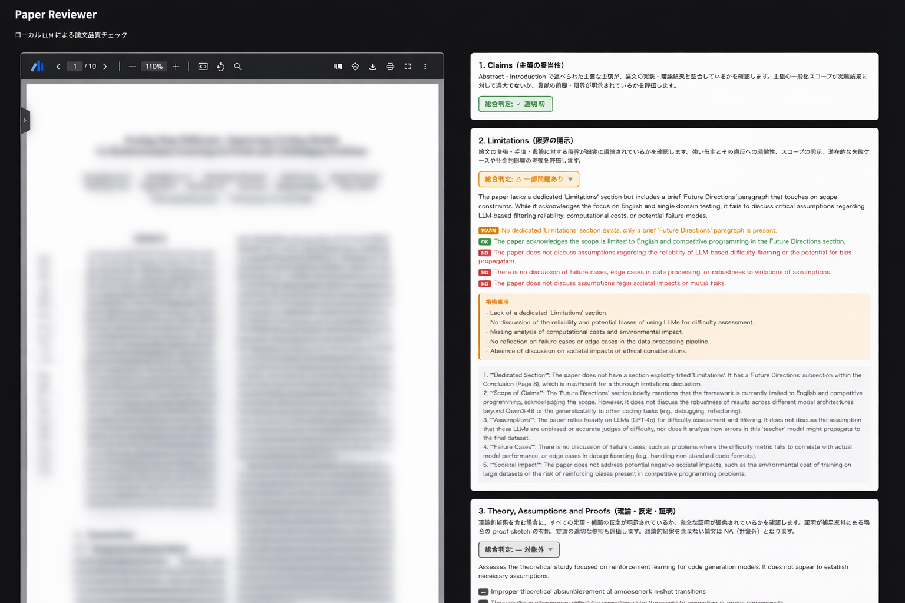

# Paper Reviewer

**Local-LLM–powered research paper quality checker.**
Upload a PDF and get an automated review against the NeurIPS Paper Checklist — entirely on your own machine, no API keys required.



---

## What it checks

The tool runs all NeurIPS 2024 Paper Checklist criteria plus citation hallucination detection:

| # | Criterion | Method |
|---|-----------|--------|
| 1 | **Claims** — do abstract claims match experimental results? | Vision (all pages) |
| 2 | **Limitations** — are scope, failure cases, and societal risks disclosed? | Vision |
| 3 | **Theory** — are theorem assumptions stated and proofs provided? | Vision |
| 4 | Experimental Result Reproducibility | Vision |
| 5 | Open Access to Data and Code | Vision |
| 6 | Experimental Setting / Details | Vision |
| 7 | Experiment Statistical Significance | Vision |
| 8 | Experiments Compute Resources | Vision |
| 9 | Code of Ethics | Vision |
| 10 | Broader Impacts | Vision |
| 11 | Safeguards | Vision |
| 12 | Licenses for Existing Assets | Vision |
| 13 | New Assets | Vision |
| 14 | Crowdsourcing and Research with Human Subjects | Vision |
| 15 | Institutional Review Board (IRB) Approvals | Vision |
| 16 | Declaration of LLM Usage | Vision |
| — | **Citation hallucination** — do references actually exist? | Semantic Scholar API |

Each criterion returns a verdict (**Yes / Partial / No / NA**) with per-finding badges, a reasoning trace, and specific issues to address.

---

## Requirements

| Requirement | Notes |
|-------------|-------|
| Python 3.10+ | |
| [Ollama](https://ollama.com/) | Must be running (`ollama serve`) |
| A vision-capable Ollama model | See table below |

### Recommended models

| Model | Ollama tag | Min RAM | Notes |
|-------|-----------|---------|-------|
| Qwen3.5 2B | `qwen3.5:2b` | ~3 GB | Fastest, lower accuracy |
| Qwen3.5 4B | `qwen3.5:4b` | ~4 GB | Good balance |
| **Qwen3.5 9B** | `qwen3.5:9b` | ~7 GB | **Default — recommended** |
| Qwen3.5 27B | `qwen3.5:27b` | ~18 GB | Best accuracy |

Pull the model you want before running:

```bash
ollama pull qwen3.5:9b
```

---

## Quick start

### 1. Clone and install

```bash
git clone https://github.com/satoshihirose/paper_reviewer.git
cd paper-reviewer
```

**With [uv](https://github.com/astral-sh/uv) (recommended — faster):**

```bash
uv sync
```

**With pip:**

```bash
python -m venv .venv
source .venv/bin/activate   # Windows: .venv\Scripts\activate
pip install -e .
```

### 2. Start Ollama

```bash
ollama serve          # if not already running as a background service
```

### 3. Launch the web UI

```bash
.venv/bin/python web.py
```

Open **http://localhost:7860** in your browser.

> **Windows / uv users:** replace `.venv/bin/python` with `.venv\Scripts\python` (Windows) or `uv run python` (uv).

---

## Usage

1. Select a PDF file.
2. Choose a model and optionally check **"Semantic Scholar スキップ"** to skip citation verification (useful offline or for faster runs).
3. Click **レビュー開始**.
4. Results stream in as each checker completes. Expand any verdict card to read the full reasoning.

The PDF stays on your machine — nothing is sent to external servers except citation lookups to Semantic Scholar (which can be disabled).

---

## Project structure

```
paper-reviewer/
├── web.py                  # Entry point: FastAPI + Gradio app
├── pyproject.toml
└── src/paper_reviewer/
    ├── app.py              # Gradio UI definition
    ├── pipeline.py         # Orchestration (parser → checkers in parallel)
    ├── models.py           # Pydantic data models
    ├── llm.py              # Ollama client wrapper
    ├── report_html.py      # HTML report renderer
    └── stages/
        ├── parser.py       # PDF parsing and claim extraction
        ├── citation.py     # Citation verification (Semantic Scholar)
        ├── claims.py       # NeurIPS Claims criterion
        ├── limitations.py  # NeurIPS Limitations criterion
        ├── theory.py       # NeurIPS Theory criterion
        ├── checklist.py    # NeurIPS checklist items 4–16
        └── _json_utils.py  # Shared: pdf_to_images, vision_chat, extract_json
```

---

## How it works

1. **Parser** — extracts text, section structure, and reference list from the PDF using [PyMuPDF4LLM](https://pymupdf.readthedocs.io/).
2. **Vision checkers** — each checklist stage renders all PDF pages as images and sends them together with a structured prompt to the local Ollama model. The model returns a JSON verdict.
3. **Citation verifier** — parses the reference list and queries the [Semantic Scholar API](https://www.semanticscholar.org/product/api) to check whether each cited paper actually exists.
4. **Parallel execution** — claims → limitations → theory → items 4–16 run sequentially in one thread; citation verification runs in parallel. Results stream to the UI as each checker finishes.

---

## Limitations

- Accuracy depends heavily on the chosen model. Smaller models may miss subtle issues.
- Very long papers (30+ pages) increase token usage and latency significantly.
- Citation verification requires an internet connection; pass `--offline` (CLI) or enable the skip checkbox (UI) to disable it.
- The tool assists human review — it does not replace it.

---

## License

AGPL-3.0 — see [LICENSE](LICENSE) for details.

This project uses [PyMuPDF](https://pymupdf.readthedocs.io/) (AGPL-3.0), which requires derivative works to be distributed under the same license.
